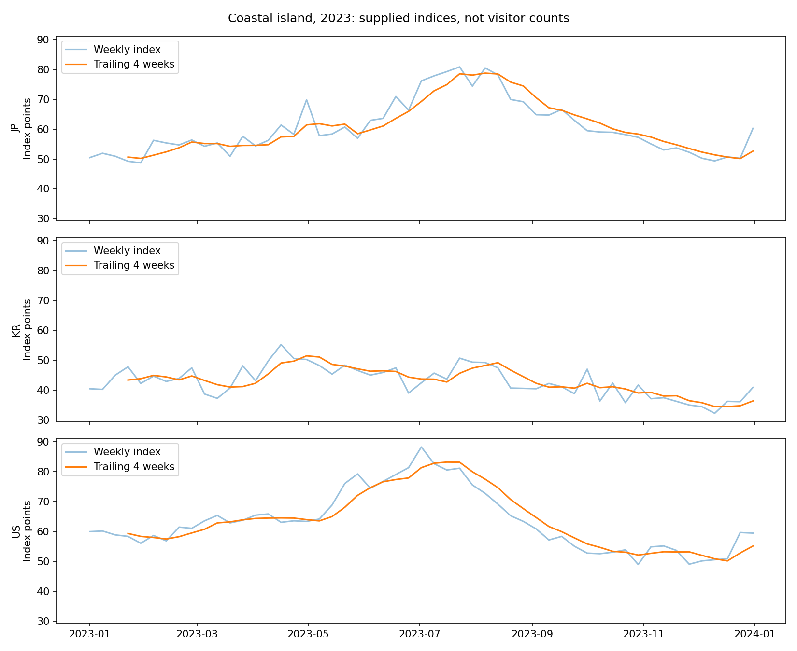
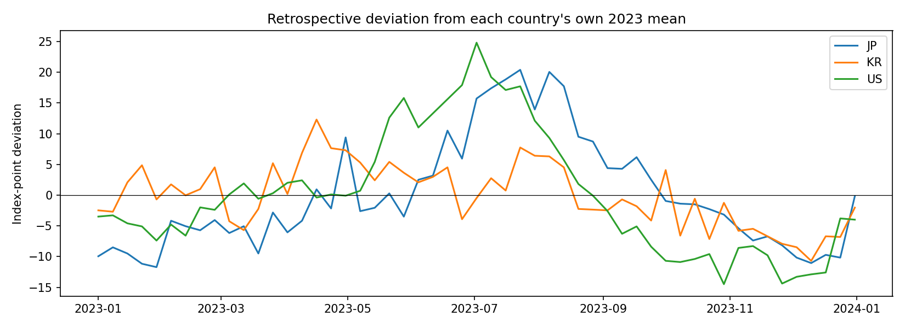

# Coastal-island tourism search-demand analysis, 2023

## Conclusion

The data measures tourism search demand through Google Trends' relative search-interest index. The data owner confirmed that the records came directly from Google Trends, concern tourism destinations, use Web Search, and use the same category filter. Here, search demand means relative interest expressed through searches, not the number of searches, bookings, or visitors.

Search interest changes during 2023 in all three countries. One country does not have the highest recorded monthly index throughout the year: the United States has the highest in January through July and December, while Japan has the highest in August through November. South Korea never has the highest monthly index in this selected category and year.

The remaining uncertainty concerns comparison between countries, not whether the data represents search interest. Using the same category and search type helps align the subject being measured, but does not establish a common numerical scale if the countries were downloaded separately. Until the collection setup is documented, the observed index changes do not prove that the country with the greatest amount of tourism search demand changed.

## What the data shows

| Period | Highest supplied monthly index |
| --- | --- |
| January through July | United States |
| August through November | Japan |
| December | United States |

The highest supplied monthly index changes countries twice. The United States accounts for eight months and Japan for four. November is nearly tied: Japan averages 53.47 and the United States 53.23, a difference of only about 0.25 index points. A numerical lead this small should not automatically trigger a recommendation change.

All three countries have 53 Sunday-labeled observations in 2023, with no missing observations for this category under the assumed calendar. The Google Trends source, tourism subject, Web Search type, and shared category filter are confirmed by the data owner. Exact query settings and download details still need to be recorded for reproducibility and cross-country comparison.

## Required changes before dataset generation

1. **Record the collection settings.** Create `data/collection_metadata.json`. Record the confirmed provider, Google Trends, search type, Web Search, tourism subject, and shared category filter. Add the exact category identifier, search terms or topics, category definitions and version, country filters, requested date ranges, collection timestamps, and any processing used to produce the category columns.
2. **Verify the weekly calendar and availability.** Confirm whether Sunday labels mark the start or end of a week, the source timezone, and when completed weekly observations become available. The current Sunday-start, UTC, zero-publication-lag settings are provisional. Correct them if the source uses different rules.
3. **Check how the country scores were scaled.** Document whether the countries were compared together or collected through separate location-filtered downloads, and whether the exported scores share a comparable scale. Recollection is not automatically required. If the scales are incompatible, retain the data for within-country trend analysis and use a reviewed comparison method before ranking countries by demand level.
4. **Rerun and review the diagnostic.** After correcting metadata or configuration, use a new dataset version and rerun the fixed coastal-island analysis for 2023. Record the review decision before generating model-ready datasets.

No missing-value repair is needed for the selected category and year. There is no reason to reject these records merely because they measure relative search interest. Keep the 2020-2022 exclusion and preserve the gap between pre-pandemic and post-pandemic history. Do not alter observations, remove a country, or force countries to take turns leading.

## Recommendation changes

Do not change production recommendation logic based on this report alone. If comparable data later confirms meaningful leadership changes, a separate recommendation-design task should define the minimum lead and persistence needed to change recommendations. This report does not establish those thresholds, and one category in one year cannot show how all categories will behave.

**Current status: dataset generation remains paused pending verified collection metadata and diagnostic approval.**

## Meaning of the Google Trends index

Google Trends uses actual search activity to calculate relative popularity, normalized for the query's time and geography and scaled from 0 to 100. The index supports analysis of tourism search interest; it does not report absolute search counts. Matching index values in different regions do not necessarily represent matching search volumes. [Google Trends data explanation](https://support.google.com/trends/answer/4365533?hl=en).

## Charts

The first chart shows each country's weekly index and trailing four-week average. The second shows deviations from each country's own 2023 average. These retrospective deviations describe timing within each series; they are not visitor counts or model input features.

