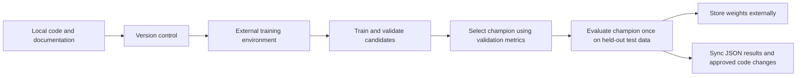

# Training contract

## Workflow

## Data and candidate plan

Use versioned category CSVs for South Korea, Japan, and the United States with verified collection metadata. Each of the 21 market-category series targets 12 future weekly Google Trends values. Dataset preparation requires the fixed 2023 coastal-island diagnostic and an approved review. Exclude 2020 through 2022, including overlapping boundary weeks. Begin with three required baselines: last value, seven-week moving average, and 52-week seasonal naive. Then compare BiLSTM-only, Transformer-only, and BiLSTM + Transformer models using seeds 42, 123, and 2026. The [forecasting experiment specification](forecasting_experiments.md) defines the initial nine neural runs; other forecasting candidates are outside this first comparison. The existing provisional export and its unresolved approval status are documented in the [dataset review](data.md#dataset-assumptions-and-provenance-review).

Do not use past Groq or Gemini forecasts as labels.

## Selected experiment stack

The user agreed to the initial stack on September 9, 2026 and selected Weights & Biases on September 10. The [Colab notebook and runner](../training/README.md) are implemented. Runtime provisioning and dataset approval remain separate.

| Component | Selected approach | Setup still required |
| --- | --- | --- |
| Framework | PyTorch | Pin and validate Python, PyTorch, and supporting dependency versions in the external environment. |
| External compute | Google Colab GPU | Prepare the runtime and verify available hardware, memory, and access before runs. |
| Experiment tracking | Weights & Biases, with JSON/CSV mirrored to Drive | Add the W&B API key to local .env; validate online logging in Colab. The logging implementation is complete. |
| Artifact destination | Google Drive | Confirm the exact project folder, owner, permissions, capacity, retention, and successful save/reload. |

Use repository functions for model, preprocessing, and evaluation logic; notebooks only orchestrate them. The initial settings remain those in [forecasting experiments](forecasting_experiments.md#shared-initial-training-settings). The dataset and numerical experiment settings remain frozen; [forecasting-v2-wandb](../experiments/forecasting-v2-wandb.json) records the tracker revision without modifying the original protocol. External runtime provisioning remains separate.

For each run, persist configuration, dataset version/fingerprint, code revision, architecture, seed, feature order, vocabulary/schema identity, hardware/software versions, best epoch, parameter count, duration, validation results, and artifact location. Save per-epoch training and validation loss in CSV. Persist the best validation checkpoint and compatible preprocessing metadata to the selected Drive folder, then verify restoration before relying on it. A runtime-local checkpoint alone does not satisfy the storage requirement.

Only lightweight run summaries belong in `experiments/`. Keep datasets, weights, detailed tracker logs/exports, and credentials outside Git. Do not populate test metrics before the selected artifact's one-time final evaluation. Category-based alert and ranking metrics remain deferred until integration semantics are defined.

Before training, close the provenance and governance blockers, verify access to the original saved vocabulary/schema, and configure the selected runtime and storage. The [frozen protocol](forecasting_protocol.md) defines MAPE/sMAPE zero handling, checkpoint rules, and the final seed policy. The available dataset files are checksum-locked and train/validation identities were independently cross-checked; original saved metadata access remains unresolved. Production deployment remains undecided and is separate from the Colab experiment environment.

## Splits, evaluation, and selection

Use common chronological 80/10/10 partitions of eligible calendar weeks, with the entire diagnostic year in training. Do not randomly shuffle rows. Each complete target stays inside its partition; no history or target bridges the pandemic gap. Roll forecast origins within validation for development. Keep the test partition sealed until the selected champion's final evaluation.

Report MAE, RMSE, and sMAPE by forecast horizon and as a 12-week summary. Report MAPE only when targets are not near zero. Also report directional accuracy and demand-alert precision and recall when category integration semantics are defined. Select candidates using validation improvements only; never select or retune on held-out test results. The existing interface MAPE warning above 15% is not a model-selection criterion.

## Required invariants

- Seed language, numerical, framework, and loader randomness consistently where the stack supports it.
- Use train, validation, and held-out test partitions with a documented leakage-resistant split strategy appropriate to the task.
- Train candidates on training data and choose the champion using validation metrics only.
- Evaluate the selected champion on the held-out test set once for the final report. Do not use test results for model selection.
- Save the best validation checkpoint, not simply the last epoch.
- When supported, document early stopping metric, direction, patience, and minimum improvement.
- Track configuration and epoch metrics in the selected tracker, or document the approved equivalent.
- Store large artifacts outside normal Git history. Record only lightweight metadata in `experiments/`.

## Retraining and monitoring

Retrain on a schedule that matches data availability, such as monthly or quarterly, not on every user request. Monitor rolling MAE and sMAPE after outcomes arrive. Investigate drift after travel restrictions, Google Trends methodology changes, currency shocks, or new flight routes.
