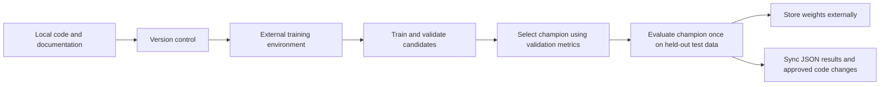

# Training contract

## Workflow

## Data and candidate plan

Use versioned category CSVs for South Korea, Japan, and the United States with verified collection metadata. Each of the 21 market-category series targets 12 future weekly Google Trends values. Dataset preparation requires the fixed 2023 coastal-island diagnostic and an approved review. Exclude 2020 through 2022, including overlapping boundary weeks. Begin with three required baselines: last value, seven-week moving average, and 52-week seasonal naive. Then compare an XGBoost multi-output or per-horizon candidate and a compact global GRU or LSTM.

The framework, external training environment, tracker, artifact store, seed, and final hyperparameters are not configured. Do not use past Groq or Gemini forecasts as labels.

## Splits, evaluation, and selection

Use common chronological 80/10/10 partitions of eligible calendar weeks, with the entire diagnostic year in training. Do not randomly shuffle rows. Each complete target stays inside its partition; no history or target bridges the pandemic gap. Roll forecast origins within validation for development. Keep the test partition sealed until the selected champion's final evaluation.

Report MAE, RMSE, and sMAPE by forecast horizon and as a 12-week summary. Report MAPE only when targets are not near zero. Also report directional accuracy and demand-alert precision and recall when category integration semantics are defined. Select candidates using validation improvements only; never select or retune on held-out test results. The existing interface MAPE warning above 15% is not a model-selection criterion.

## Required invariants

- Seed language, numerical, framework, and loader randomness consistently where the stack supports it.
- Use train, validation, and held-out test partitions with a documented leakage-resistant split strategy appropriate to the task.
- Train candidates on training data and choose the champion using validation metrics only.
- Evaluate the selected champion on the held-out test set once for the final report. Do not use test results for model selection.
- Save the best validation checkpoint, not simply the last epoch.
- When supported, document early stopping metric, direction, patience, and minimum improvement.
- Track configuration and epoch metrics in the selected tracker, or document the approved equivalent.
- Store large artifacts outside normal Git history. Record only lightweight metadata in `experiments/`.

## Retraining and monitoring

Retrain on a schedule that matches data availability, such as monthly or quarterly, not on every user request. Monitor rolling MAE and sMAPE after outcomes arrive. Investigate drift after travel restrictions, Google Trends methodology changes, currency shocks, or new flight routes.
